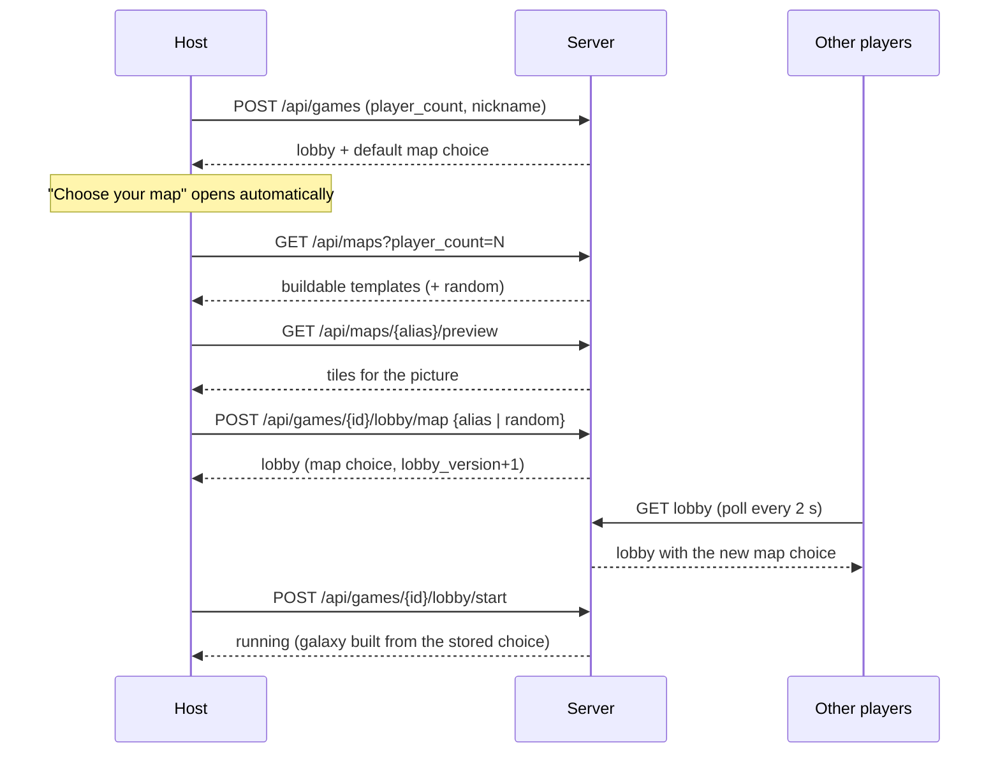

# Map selection screen: implementation plan

Status: plan only, nothing built. Written 2026-10-06.

Goal: right at the start of a game, the first human player (the host who created the lobby)
chooses what kind of map the table plays. The other players see the choice while they join and
get ready. The choice is final when the host presses Start.

## 1. Recommendation

Make the map a **lobby setting owned by the host**, editable until Start, shown to everyone in
the lobby, and chosen on a dedicated **"Choose your map" step that opens automatically for the
host right after creating the lobby**. Reuse what exists: `map_template` and `seed` are already
stored on the lobby record and already consumed by `start_player_lobby`; only the way to change
them after creation, a public view of them, and a picker are missing.

Three decisions that shape everything else:

1. **Never expose the game seed.** One seed drives the map filler *and* the engine RNG
   (`start_game_seeded` in `crates/ti4-server/src/map.rs`, `with_seed(lobby.seed)` in
   `start_player_lobby`). Showing it to players would let them predict dice and deck order. The
   picker therefore talks about a server-held map choice and receives preview tiles, never a seed.
2. **Previews come from the server**, built with the same functions the real game uses
   (`build_template_galaxy`, `build_board_tiles`), so what the host sees is what the table gets.
3. **Filter by what actually builds.** Not every template in the data builds, and only
   `player_count`-matching ones are legal. The server decides; the UI never hard-codes a list.

## 2. How things work today (grounded in the code)

| Topic | Today | Where |
|---|---|---|
| When the map is chosen | Only at `POST /api/games`, via optional `map_template`; fixed afterwards | `http/games.rs` `CreateGameRequest`, `create_game` |
| Default | No alias means `default_template_for(player_count)`; there is no way to ask for the random map explicitly | `games.rs` ~163-189 |
| Player count | Fixed at creation (slot count); templates must match it, else 400 | `games.rs` ~171-182 |
| Template ranking | First that builds under POK, preferring names ending `Standard`, then `StaticEq`, then `Hyperlanes` (not `InPerson`), then the rest | `maps/build.rs` `default_template_for` |
| Templates in data | 34 templates (sizes: 1p:1, 2p:1, 3p:4, 4p:3, 5p:4, 6p:6, 7p:4, 8p:5, 9p:3, 12p:3). Lobbies allow 2 to 8 players, so the 1p, 9p and 12p ones are unreachable | `ti4-content/content/map_templates.json`, `MAX_PLAYERS = 8` |
| Templates that do not build | `3p/4p/5p/6pStaticEq` (tile `0g` is not in the corpus) and `2025scptFinals` (a tile placed twice), per the `UNBUILDABLE` constant in the `maps/build.rs` tests. That test, not this document, is the authority | `maps/build.rs` tests |
| Template mechanics | Static tiles as given, each seat's home at its `home` slot, every other slot filled from seeded filler; no Nucleus-specific handling | `build_template_galaxy` |
| Random fallback | `create_game_with_map`: 36 seeded filler tiles, `build_board` (the seating fallback) | `map.rs` |
| Factions | Fixed by seat order from `IN_SCOPE_FACTIONS` (sol, hacan, letnev, xxcha, jolnar, l1z1x, then cycling). Reordering lobby slots changes who gets which home | `ti4-engine/src/seating.rs` |
| Lobby record | `PlayerLobbyRecord` already holds `seed`, `map_template`, `start_preset`, all `serde(default)`, so old saves load | `storage.rs` ~171-187 |
| Public lobby view | `PlayerLobbyView` has no map fields, and deliberately no seed | `session/registry.rs` ~314 |
| Start | Host only; requires all slots filled and everyone ready; builds galaxy and state from `lobby.map_template` + `lobby.seed`; saves init record including `map_template` | `start_player_lobby` ~2169 |
| Recovery | Unstarted lobbies recover from the lobby record. Started games rebuild the galaxy from `(seed, player_ids, map_template)`; the initial state, including any start preset, is stored in the init record | `storage.rs` `recover_from_init` ~820-860 |
| Web | `CreateLobby` form (players, nickname, seed) then `LobbyStatus` (slots, ready, bots, Start). Lobby state is polled every 2 s (`useLobbySession`), there is no WebSocket in the lobby; `App.tsx` switches to the game when `phase === "running"` | `components/Lobby.tsx`, `hooks/useLobbySession.ts` |
| Host rules | The host cannot leave the lobby (`HostRequired`) and there is no host transfer | `registry.rs` ~2073 |
| Board renderer | `Board` takes a `BoardView` (with `map_tiles`) and a seating order | `components/Board.tsx` |

## 3. User stories

- As the **host**, right after creating a table I am asked what kind of map to play, with a good
  default already selected, so I can just confirm.
- As the host I can browse the maps that fit my player count, see each as a picture of the galaxy,
  and read a one-line description (author, size, hyperlanes yes/no).
- As the host I can pick **Random** and re-roll until I like the look of it.
- As the host I can change my mind until I press Start.
- As a **joining player** I see which map the host chose, a preview of it, and when it changes,
  without being able to change it.
- As a player I can see where **my seat** (and faction) sits on the map before the game starts.
- As a **developer or tester** I can still start games with an explicit template and, behind a dev
  flag, a start preset, without going through the UI (the smoke harness depends on this).

## 4. Where it sits in the flow

The player count is fixed when the lobby is created, so the map step belongs after creation and
before Start, not in the create form (which stays as simple as it is).



Why not ask at Start? Players are waiting for the host while they are ready; showing the map
earlier lets everyone look at it while the table fills, and a bad map can be fixed before
anyone is ready. Why not in the create form? The picker needs previews and a player count, and a
long form hurts the create step; the automatic open after creation gives the same "right at the
start" feeling.

## 5. Options on the screen

1. **Templates for this player count** (from the server, buildable only). Each card shows a
   thumbnail, name, author, whether it has hyperlanes, and the number of systems.
2. **Random map.** Server-generated, with a **Re-roll** button; the host sees the result.
3. **Recommended** badge on the default (`default_template_for`).
4. Later: balance information per seat (resources and influence within two jumps of each home),
   to help people judge fairness. Computed from the preview tiles' planet data (`PlanetMetaView`
   already carries resources and influence).
5. **Dev only, behind a flag:** start preset (`combat`) and an explicit seed field. Not shown to
   normal players. Whether the existing advanced Seed input stays in the create form is an open
   question (section 12).

Labels to fix before shipping: the `...Nucleus` templates build but nothing in `maps/*.rs`
handles a Nucleus, and the `InPerson` one is meant for physical tables. Either hide them until
checked or give them an honest label.

## 6. Server design

### 6.1 Data model

No schema change is strictly required: `PlayerLobbyRecord` already has `map_template` and
`seed`. Add a small explicit enum to say what the choice is, because `None` currently means
"use the default" and cannot mean "random":

```text
MapChoice = Template { alias } | Random
```

Store it as the existing optional `map_template` plus an optional `map_random: bool` (both
`serde(default)`, so existing records load unchanged), or as one new optional field. The persisted
`PlayerGameInitRecord.map_template` stays as it is; `None` there already means random, which is
what `recover_from_init` expects.

Re-rolling the random map or a template's open slots needs a new seed. Because the seed is also the
engine seed, either (a) change it (fine before Start, nothing has happened yet) and never reveal
it, or (b) split out a domain-separated `map_seed`. Option (a) is enough and needs no engine
change; it is what the plan assumes.

### 6.2 API

New or changed endpoints (all under the existing lobby auth, `x-ti4-player-session`):

| Endpoint | Who | Purpose |
|---|---|---|
| `GET /api/maps?player_count=N` | anyone | List templates for N that build under POK. Add `buildable`, `systems`, `hyperlanes` to `MapTemplateSummary`; keep the current response shape valid so nothing breaks |
| `GET /api/maps/{alias}/preview?variant=K` | anyone | `BoardTileView[]` plus summary for the picture. Uses placeholder homes (the default seat factions) so it matches the real game. `variant` selects a server-side filler variant for the open slots without exposing a seed |
| `POST /api/games/{id}/lobby/map` | host, lobby phase only | Body `{ "map": { "kind": "template", "alias": "..." } }` or `{ "map": { "kind": "random" } }`, plus `"reroll": true`. Validates, saves the lobby record, bumps `lobby_version` |
| `GET /api/games/{id}/lobby` (existing) | players | `PlayerLobbyView` gains `map: { kind, alias?, author?, systems, hyperlanes }` and `map_revision: u64` so clients know when to refetch the preview |
| `GET /api/games/{id}/lobby/map-preview` | players in the lobby | Preview tiles of the *current* choice, as built with this table's seat order |

`POST /api/games` keeps accepting `map_template` and `start_preset` exactly as now, so the smoke
harness and every existing script work unchanged. It additionally accepts `"map": "random"` to
create a random-map lobby explicitly.

### 6.3 Validation and errors

- Not the host: `403` (`LobbyError::HostRequired`).
- Lobby already running: `409` (`AlreadyRunning`).
- Unknown alias, alias for another player count, or a template that does not build: `400`
  (new `LobbyError::InvalidMap(String)`, mapped in `lobby_error`).
- A build failure at Start (`LobbyError::Map`): keep returning `500`, but the picker should make this
  unreachable, and the Start response should say which map failed so the host can choose another.
- To be safe, validate by actually building the galaxy with placeholder homes at choice time,
  not only by looking the alias up.

### 6.4 Persistence and recovery

- Every change goes through the same path as ready/reorder (`save_player_lobby`, `lobby_version += 1`).
- An unstarted lobby recovers from the lobby record, including the map choice.
- A started game is unaffected: `start_player_lobby` copies the choice into the init record.
  Add a recovery test that restarts mid-lobby after a map change.

### 6.5 Everyone sees the choice

The lobby already refreshes by polling every 2 s, so the choice reaches players within 2 s once it is
in `PlayerLobbyView`. A WebSocket push for the lobby is not needed for this feature. The client
refetches the preview when `map_revision` changes.

## 7. UI

### 7.1 Host: picker

```text
+--------------------------------------------------------------+
| Choose your map                     4 players        [ Done ] |
|--------------------------------------------------------------|
|  [thumb]   [thumb]   [thumb]   [thumb]   [ ? ]               |
|  Standard  Hyperlanes Nucleus  Be My Nghbr  Random           |
|  *Recommended                                [Re-roll]       |
|--------------------------------------------------------------|
|                   large preview of the selected map           |
|        seat 1 Sol   seat 2 Hacan   seat 3 Letnev ...         |
|--------------------------------------------------------------|
|  6pStandard by <author> · 37 systems · no hyperlanes          |
+--------------------------------------------------------------+
```

States: loading (skeleton cards and a spinner on the preview), error with Retry (list failed or the
preview failed), empty (no buildable map for this count; Random is still offered and an explanatory
line is shown), saving (the selected card shows a spinner, others disabled), and "changed by
another request" (lobby_version mismatch: refetch and keep the host's selection if still valid).

### 7.2 Joining players: read-only card in the lobby

```text
Map: 6pStandard (chosen by <host>)         [ View map ]
```

`View map` opens the same large preview, read-only, with the viewer's own seat highlighted. When
the host changes it, a short notice appears ("The host changed the map").

### 7.3 Mobile

The picker is a full-screen sheet. The thumbnails are a horizontally scrolling strip (one row);
the large preview sits above the strip and can be pinch-zoomed. Done is a sticky bottom bar.
Everything stays at least 16 px from the screen edges and the page never scrolls sideways.

### 7.4 Components (new)

`MapPicker`, `MapCard`, `MapThumbnail` (lightweight SVG of hex tiles, used in the grid),
`MapPreview` (large, wraps `Board`), a `useMapChoice` hook (list, preview, choose), and a "Map"
row in `LobbyStatus`. `CreateLobby` stays as is, apart from the optional hand-off that opens the
picker once the lobby exists.

## 8. Preview rendering

- **Grid thumbnails:** a small SVG that draws one coloured hex per tile (colour by tile kind: home,
  Mecatol, anomaly, wormhole, empty, hyperlane). 34 of these are cheap; no `Board` needed. The tile
  list comes from the preview endpoint; it can be cached per `(alias, variant)` since it does not
  change.
- **Large preview:** build a minimal `BoardView` from the returned `map_tiles` (empty `systems`
  and units, no combat) and render it with the existing `Board` component with seating order
  placeholders, overlay mode `none`, tile selection disabled. This reuses geometry, planet icons and
  tooltips, so the preview and the game look the same. Seat badges on home tiles use the existing
  seat styling.
- Hyperlane tiles carry rotation in their ids; `build_board_tiles` already resolves them (see
  `resolve_static`), so the preview needs no extra handling.

## 9. Edge cases

| Case | Behaviour |
|---|---|
| Host disconnects | Nothing changes: the host cannot leave and there is no transfer today. The choice stays; if the host never returns the lobby cannot start, which is the existing behaviour. A host-transfer feature is out of scope |
| Bots | Unaffected: bots join slots and are added after the map is chosen; the map does not depend on who sits where except for seat order (below) |
| Slot reorder after choosing | Seat order decides who gets which home and faction. `reorder` should bump `map_revision` so the preview is refetched and seat labels stay correct |
| Player count changes | Not possible after creation (fixed slot count), so a chosen template can't become invalid |
| Spectators | Can watch the lobby read-only, with the same card and View map button |
| Host picks, then a player joins late | Nothing to do; the choice is already visible to them |
| Two requests race (double click, two tabs) | Last write wins; the response carries the new `lobby_version`, the client reconciles |
| Server restart in the lobby | Recovers from the lobby record with the choice intact |
| Template data later changes | A started game rebuilds its galaxy from `(seed, players, alias)` on recovery, so renaming or editing a template would change old games. Keep aliases and tile data append-only, and add a recovery test that fails if a shipped template's output changes |
| Old saves | New fields are `serde(default)`; behaviour matches today (no choice means default template) |

## 10. Test plan

**Unit (Rust, `maps` and registry):**
- Every offered template builds for its player count; the picker list equals the build-all test's
  result (no hand-kept list).
- `lobby/map` accepts a valid template and Random, rejects unknown alias, wrong player count,
  unbuildable template, non-host, and running lobby, with the right status codes.
- `lobby_version` and `map_revision` bump; the lobby record round-trips; an old record without the
  new fields loads.
- Recovery: restart after choosing, then Start, then compare the galaxy tiles with the preview.
- The preview endpoint's tiles equal the started game's `map_tiles` for the same choice and seat
  order (the key correctness test: what you see is what you get). For open slots, the preview of
  the chosen variant must equal the real game's filler.
- The seed never appears in any lobby or preview response (a serialization test that scans the JSON).

**Unit (web, Vitest):** `MapPicker` states (loading, error, empty, saving, selected), host vs
read-only rendering, notice on change, `useMapChoice` refetching on `map_revision`, thumbnail
renders one hex per tile, mobile layout does not overflow.

**Playwright e2e:** extend `lobby_lifecycle.spec.ts`: host creates, picker opens, host chooses a
template, a second browser sees it within 2 s, host re-rolls Random, Start produces a board whose
tile ids equal the preview.

**Smoke harness and nightly:** unchanged by design. `createStartedGame` posts
`player_count`, `seed`, `nickname` (and `start_preset`) to `POST /api/games`, which keeps working.
Add one nightly option, `TI4_SMOKE_MAP`, that calls `lobby/map` for a random buildable template
before Start so the new path is exercised on part of the runs, and add a dedicated e2e for the UI
so the nightly does not need to click through the picker.

## 11. Phased rollout and rough sizes

| Phase | Content | Size |
|---|---|---|
| 1 | Server: `MapChoice` handling, `lobby/map`, validation, `map` in the lobby view, `GET /api/maps?player_count`, tests, recovery test | about 1 day |
| 2 | Preview endpoint, filler variants, the preview-equals-game test, seed-never-leaks test | about 1 day |
| 3 | UI: lobby "Map" row, picker, thumbnails, read-only view, states, Vitest | about 2 days |
| 4 | Large preview with `Board`, seat highlighting, mobile layout, Playwright e2e | about 1.5 days |
| 5 | Polish: balance information per seat, labels for Nucleus/InPerson, dev-only preset control, harness option | about 1 day |

Phases 1 and 2 can ship behind no UI change; phases 3 and 4 make it visible. Phase 5 is optional.

## 12. Open questions for the user

1. **Where exactly?** Is "automatically opens for the host right after creating the lobby, but stays
   editable in the lobby until Start" what you want, or should it be a hard step that blocks the
   lobby until the host confirms?
2. **Random map:** keep a Re-roll with visible results (needs previews of random maps), or keep
   random as "surprise me" with no preview?
3. **Which templates to offer?** The data has Nucleus, InPerson and Spoon/Condensed styles. Offer
   all that build, or a curated short list per player count?
4. **Balance information:** worth building (phase 5), or is a picture enough?
5. **Seed field:** keep the advanced Seed input in the create form, hide it, or move it behind a dev
   flag? A visible seed breaks the "players cannot predict the game" property for shared lobbies.
6. **Seat order:** since factions follow seat order, should the picker show faction names per seat,
   and should the host be able to reorder from the same screen?
7. **Do players get a vote** (for example an "I don't like this map" button) or is the host's choice
   final?
8. **Host leaving:** is a host-transfer feature wanted soon? It is out of scope here but affects how
   stuck a lobby can get.

## 13. Decisions (2026-10-06)

The user accepted the plan's recommended defaults for all open questions in section 12. In
practice that means:

- The picker is a step that opens automatically for the host after creating the lobby and stays
  editable until Start (section 1), not a hard blocking step.
- The game seed is never shown to players (section 1, decision 1); the picker uses a server-held
  map choice and preview tiles. The advanced Seed input is therefore not offered to players.
- Previews come from the server and only templates that build for the player count are listed
  (section 1, decisions 2 and 3); the server decides the list, the UI does not hard-code one.
- Questions 2, 4, 6, 7 and 8 take the choice the plan marks as recommended or phase-gated;
  where the plan gives no explicit default, keep the smaller option (no vote, host choice is
  final, no host transfer yet, picture without balance numbers) and revisit after phase 1.
